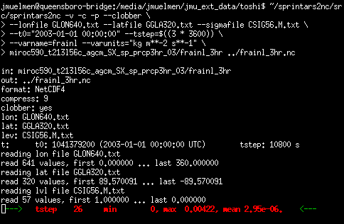

# sprintars2nc
Convert SPRINTARS unformatted Fortran output to NetCDF



## Building

blah blah blah paragraph of text

## Running

**Usage:**
`sprintars2nc [options] infile outfile`

|Option                                        |Meaning|
|:---                                          |:---|
|`-c | --compress`            (default: off)   |enable compression (implies `-f nc4`)|
|`-f | --format nc2 | nc4`    (default: nc2)   |create NetCDF v2 or v4 file?|
|`-h | --help`                                 |print this message and exit|
|`-p | --progress`            (default: off)   |enable progress bar|
|`-v | --verbose`                              |increase verbosity; may be repeated|
|`-v`                                          |print version and exit|
|`--clobber`                  (default: off)   |overwrite output file if it exists|
|`--lonfile <file>`           (mandatory)      |file specifying the longitude dim|
|`--latfile <file>`           (mandatory)      |file specifying the latitude dim|
|`--pfile <file> | --sigmafile <file>`         |file specifying the vertical dim (mandatory for 3D fields)|
|`--tfile <file> | --t0 <t0> --tstep <step>`   |specification of the time dim|
|                                              |<t0>: start date (as 'YYYY-mm-dd HH:MM:SS' UTC)|
|                                              |<step>: time step in seconds|
|`--varname <name>`           (mandatory)      |variable name in NetCDF output file|
|`--varunits <units>`         (mandatory)      |variable units in NetCDF output file|

infile:    unformatted FORTRAN big-endian SPRINTARS output

outfile:   NetCDF output file

**Example:**
```c
sprintars2nc -vvv -f nc4 -c -p --clobber \
  --lonfile GLON640.txt --latfile GGLA320.txt \
  --t0="2000-01-01 00:00:00" --tstep=$((3 * 3600)) \
  --varname=ps --varunits=hPa \
  ps_3hr ps_3hr.nc
```

## Contact
Johannes Mülmenstädt

https://github.com/jmuelmen

## License
GNU General License Version 3

For more information, see [LICENSE](LICENSE)